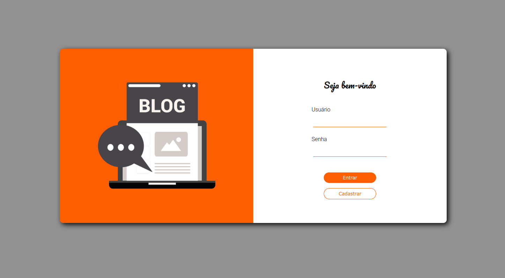

### Projeto BlogsApi



O projeto é uma aplicação fullstack onde você pode criar, editar, deletar posts e também a opção de criar um novo usuário. 

## 🛠️ Tecnologias utilizadas

- [JavaScript](https://developer.mozilla.org/en-US/docs/Web/JavaScript/Language_Resources)
- [React](https://pt-br.reactjs.org/)
- [expressJs](https://expressjs.com/pt-br/)
- [Node.js](https://nodejs.org/en/)
- [Sequelize](https://sequelize.org/)
- [Dotenv](https://www.npmjs.com/package/dotenv)
- [Joi](https://joi.dev/)
- [Mysql2](https://www.npmjs.com/package/mysql2)
- [Nodemon](https://www.npmjs.com/package/nodemon)
- [JWT](https://jwt.io/)

## 💻 Pré-requisitos

Esta aplicação utiliza o [Docker](https://www.docker.com/get-started/) e o [Docker Compose](https://docs.docker.com/compose/install/) para iniciá-la, portanto certifique-se que ambas as ferramentas estão instaladas corretamente em seu computador.

### Features

-  Cadastro de usuários,  posts, categorias.
-  Sistema de login através de token criptografados
-  Atualizar e deletar posts
-  Sistema de segurança em que apenas o dono do post pode deletar ou editar
<br>

## 🚀 Iniciando a Aplicação
Com o projeto clonado em sua máquina e dentro do diretório `blogsapi`, execute o seguinte comando do docker compose:

```
docker-compose up
```
Aguarde a instalação até que a mensagem `Conectado na porta 3001` apareça em seu terminal.

Abra seu navegador do `Google Chrome` e digite o seguinte link:

[http://localhost:3000/](http://localhost:3000/)

Aguarde até a aplicação iniciar.

## Métodos

Requisições para a API devem seguir os padrões:
| Método | Descrição |
|---|---|
| `GET` | Retorna informações|
| `POST` | Utilizado para criar um novos objetos. |
| `PUT` | Atualiza dados de um objeto ou altera sua situação. |
| `DELETE` | Remove um objeto do sistema. |

